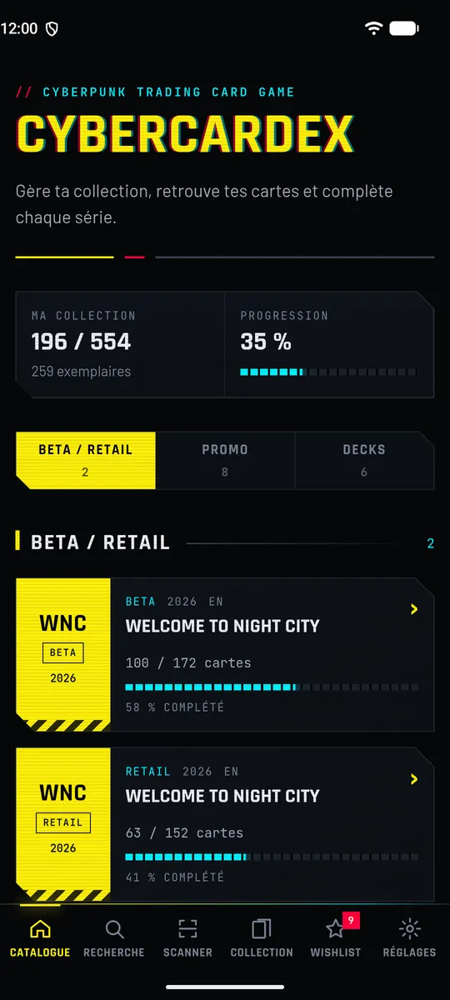
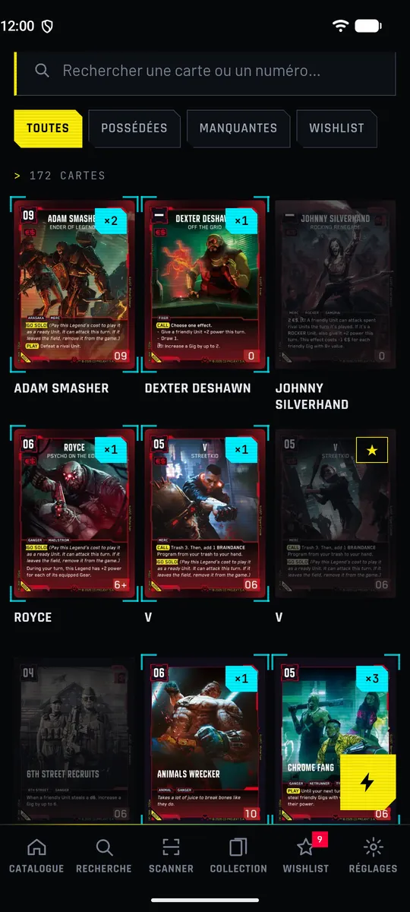
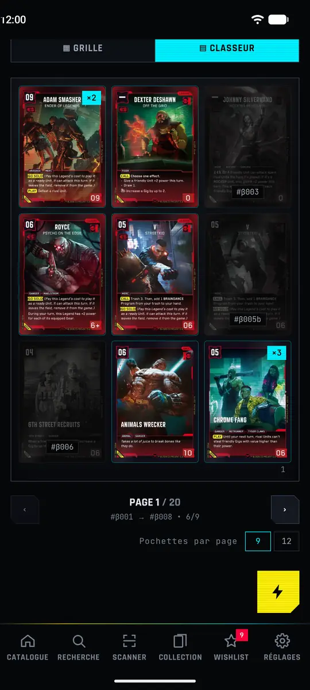
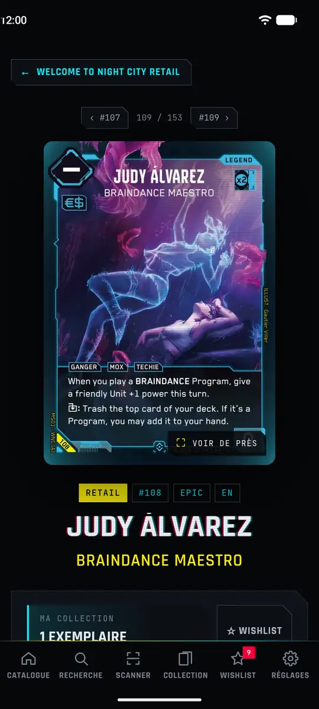
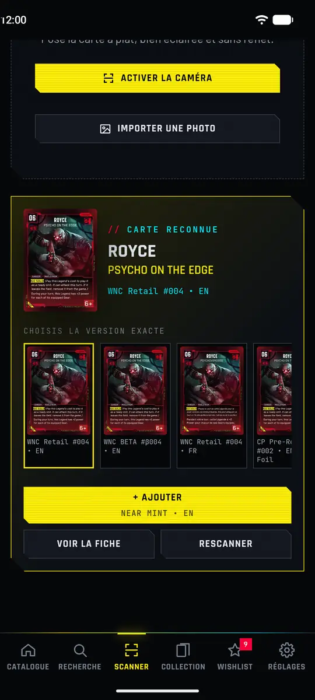
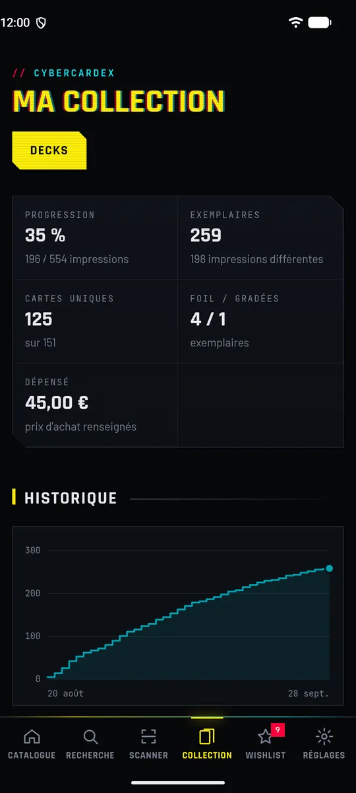
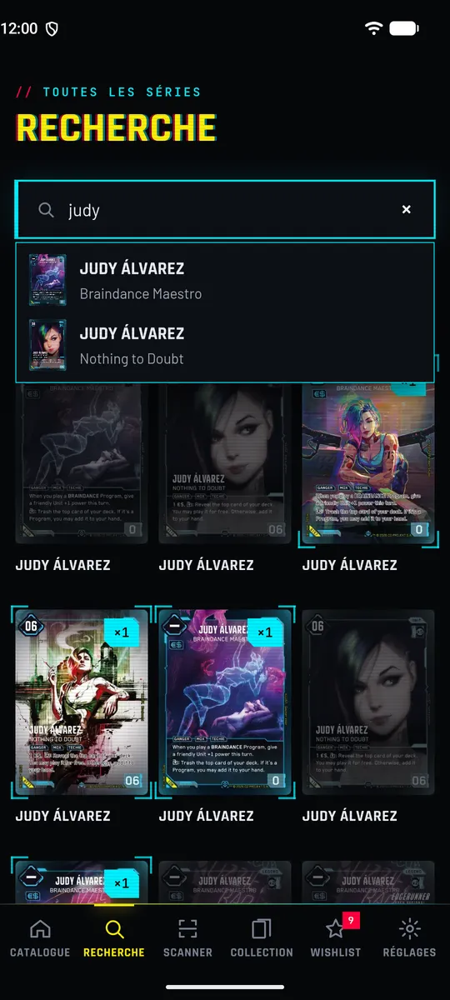
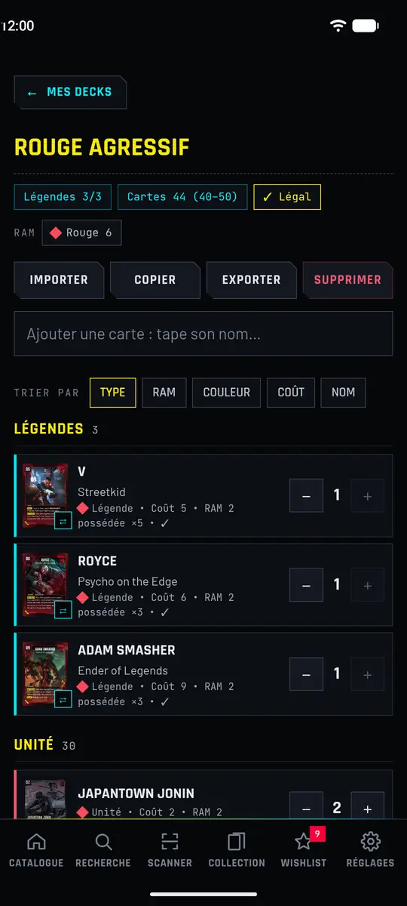

<div align="center">




[Français](README.md) · **English**

</div>

A collection manager for the **Cyberpunk TCG** card game: full catalogue, collection tracking,
wishlist, card scanner and decks. An Android app that works offline.

```console
$ jack-in cybercardex
> catalogue ................ 709 printings          [ OK ]
> scanner .................. on-device recognition  [ OK ]
> languages ................ EN / FR                [ OK ]
> card server .............. none, all built in     [ OK ]
> connection to Night City established_
```

**The app is available in English and French.** It follows your phone's language, and you can
switch at any time in Settings → Display. Cards can be shown in their English or French version.

> **`// UNOFFICIAL FAN PROJECT`**
>
> Free and not affiliated with WeirdCo or CD PROJEKT. Cyberpunk TCG is developed by WeirdCo in
> collaboration with CD PROJEKT RED. Cyberpunk, Cyberpunk 2077 and the card artwork belong to
> CD PROJEKT S.A. and their respective owners.


## Screenshots

<table>
  <tr>
    <td align="center"><br><sub>Catalogue</sub></td>
    <td align="center"><br><sub>Set page</sub></td>
    <td align="center"><br><sub>Binder</sub></td>
    <td align="center"><br><sub>Card page</sub></td>
  </tr>
  <tr>
    <td align="center"><br><sub>Scanner</sub></td>
    <td align="center"><br><sub>Collection</sub></td>
    <td align="center"><br><sub>Search</sub></td>
    <td align="center"><br><sub>Decks</sub></td>
  </tr>
</table>

<sub>Screenshots show the French interface; the app switches to English in Settings (by default
it follows the phone's language).</sub>


## Features

- **Catalogue** by set (Beta / Retail, Promo, Decks) with the progress of each set.
- **Set page** as a grid (choose the card size) or as a **binder** (pages of 9 or 12 pockets that
  turn), with search and Owned / Missing / Wishlist filters.
- **Quick add**: one tap on a card = +1 copy, perfect when opening a booster.
- **Scanner**: take a photo of a card and it is recognised on the phone, with no connection.
- **Card page**: 3D viewer (tilt, foil shine, zoom), card text, all its versions, Cardmarket link
  (daily price guide as an option).
- **Collection**: condition, grading, purchase price and notes for each copy; statistics, progress
  by set and by rarity, a chart of how your collection grows.
- **Search** across the whole catalogue (name, number, artist, affiliation, text) with suggestions
  as you type and filters.
- **Decks**: guided creation starting from your 3 Legends, deckbuilding rules checked (RAM, card
  count, copies), sorting, statistics, owned / missing cards, list import and export.
- **Wishlist** of the cards you are looking for.
- Full **backup** (collection, wishlist, decks and settings) saved wherever you like, and CSV
  export for Excel.
- **Settings**: app and card language, interface size (compact or normal), deck creation mode,
  Cardmarket (link only, link + price, or off).
- **In-app updates**: a banner tells you when a new version is out, and it installs over the app
  while keeping your collection.
- Interface in **English** or **French**, cards in EN or FR.


## What's new in version 1.1.0

- **Decks fully reworked**: a "My decks" page, a page for each deck, deckbuilding rules checked
  live, sorting, statistics and the cost to complete a deck.
- **Guided creation**: pick your 3 Legends first (and their version), then fill the deck. Or free
  creation, your choice.
- **Daily Cardmarket prices** ("Link + price" option): refreshed every day.
- **Reorganised settings**, with a choice of interface size.
- **Full backup**: collection, wishlist, decks and settings, saved wherever you like on your phone
  (no more going through the share menu).
- **Safer import**: a summary of the backup, then a two-step confirmation before merging or
  replacing your data.
- **Clear your Cardex**: double confirmation, with a little cyberpsychosis effect.
- **Back button** that always returns to the page you came from, and card page arrows that follow
  the list you came from (deck, wishlist, missing cards…).
- **Official Cyberpunk TCG links** in "About" (website, rules, social media).
- **Scanner**: an imported photo can be cropped before it is analysed (drag, pinch, rotate).
- **Tablets**: the app turns to portrait or landscape (phones stay in portrait).
- Catalogue completed (709 printings), keyboard-friendly search, many animation and small bug
  fixes.

All versions and their notes: [Releases](https://github.com/PommeSauce0/CyberCardex/releases).


## Install the app

CyberCardex is available for **Android only**, phone or tablet (not iPhone), and is not on the
Play Store:

1. On your phone, open the [latest release](https://github.com/PommeSauce0/CyberCardex/releases/latest)
   page and download the `CyberCardex-….apk` file.
2. Open the downloaded file. Android asks you to allow installing unknown apps: accept, then
   install.
3. You're done. Updates are installed from the app ("Update available" banner) and your
   collection is kept.

Remember to make a backup from time to time (Settings → My collection → Back up).


## Why is the app about 80 MB?

Because **all of Night City fits in the APK**: the 709 printings in high definition, their
thumbnails, the full catalogue and the scanner fingerprints. No image server, no catalogue
quietly downloaded in the background.

| What you get             |                                                                                                                         |
| ------------------------ | ----------------------------------------------------------------------------------------------------------------------- |
| **100% offline**         | Binder, search, decks and scanner work in airplane mode.                                                                |
| **No card server**       | Images and catalogue are built in; only GitHub is contacted, for updates and optional prices (see [Privacy](#privacy)). |
| **Nothing goes missing** | Your cards still show up if a website goes down or changes.                                                             |

**What about new sets?** They come with a new version of the app: an "Update available" banner
shows up, two taps and it's installed, and your collection is kept.


## Privacy

CyberCardex collects no data: no account, no ads, no analytics. Your collection stays on your
device unless you export it yourself.

The app only contacts GitHub, and only to:

- check, when it starts, whether a new version exists;
- download the daily prices, if Cardmarket is set to "Link + price" (Settings → Experimental
  features).

GitHub then sees your IP address, as with any website. The Cardmarket, cyberpunktcg.com and
official Cyberpunk TCG links open those sites in your browser.


## License

Code under the [MIT](LICENSE) license, provided as is, without warranty. Card data and artwork are
not covered by this license: they remain the property of their owners. Cardmarket prices are for
reference only.


<div align="center"><sub><code>// SEE YOU IN NIGHT CITY, CHOOM_</code></sub></div>
